This repository includes a collection of open-source and custom-built BOFs that have been ported to Brute Ratel C4. They are designed to work out of the box and have been tested for execution. However, any existing bugs in the original open-source projects have not been addressed and may not be fixed here. This repository solely focuses on porting and execution, without modifying the original source for stability. While I may conduct further testing in the future, this is not officially supported.

Source: https://github.com/trustedsec/CS-Remote-OPs-BOF

## Add User

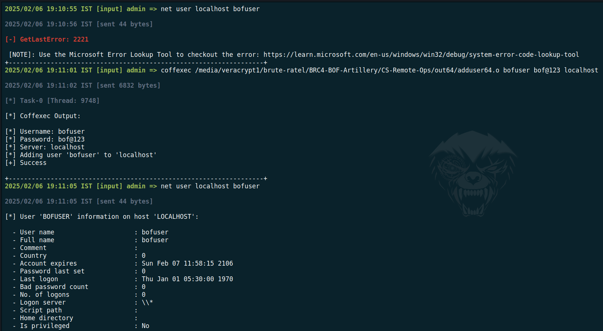

## Add User To Group

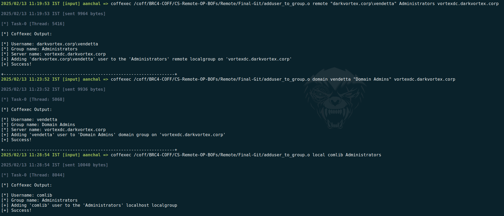

## Make Token with PFX Certificate

## Create Registry Key

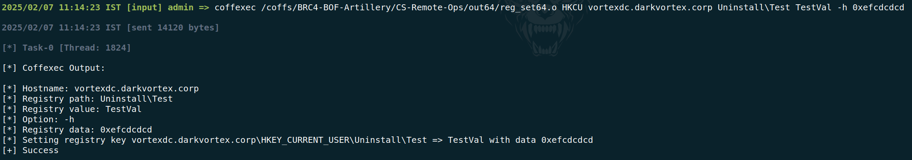

## Save Registry

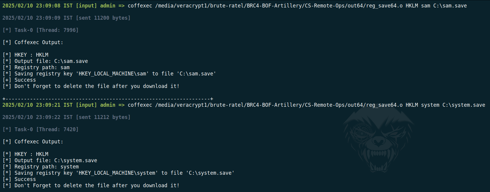

## Delete Registry

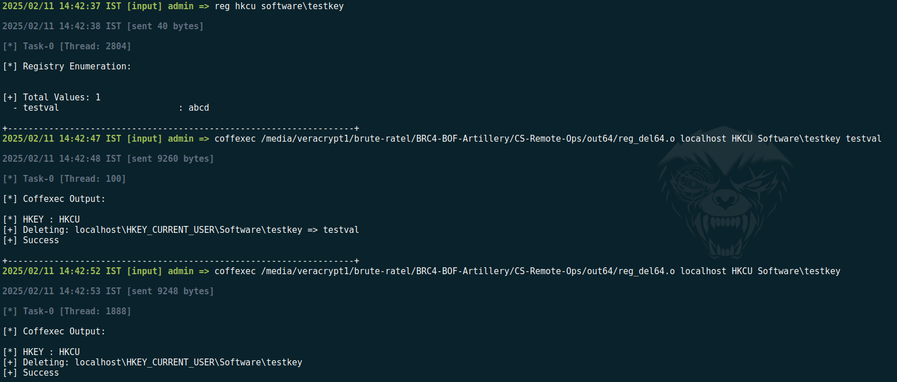

## Change Password

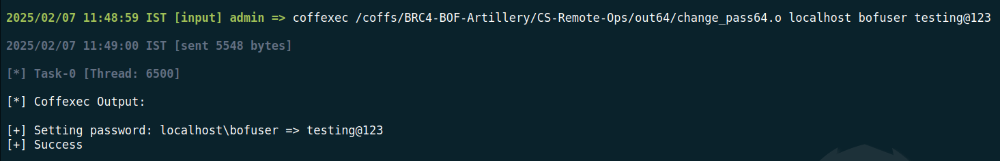

## ADCS Enum

## ADCS Request 

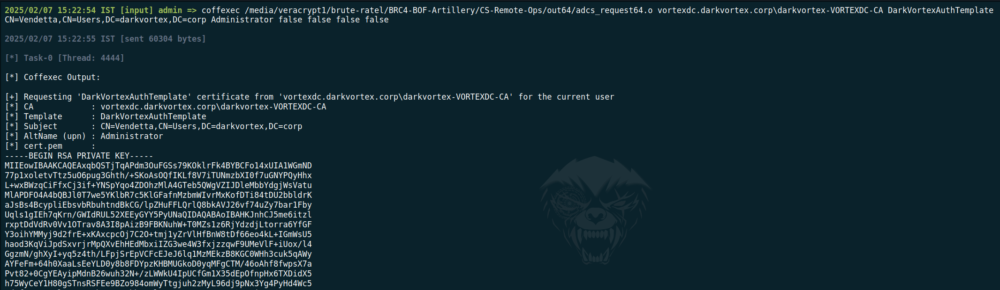

## Local/Remote Shutdown

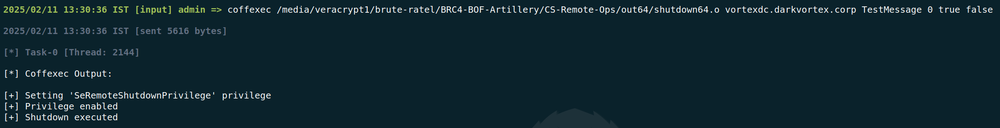

## Unexpire User

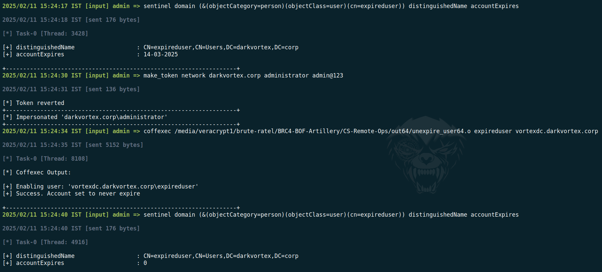

## Create scheduled task

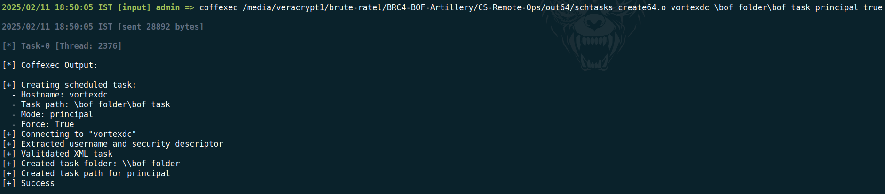

## Delete scheduled task

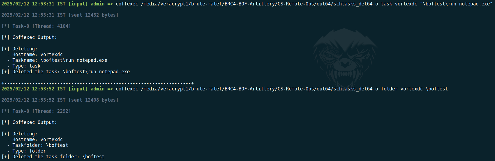

## Run scheduled task

## Stop scheduled task

## List process handles

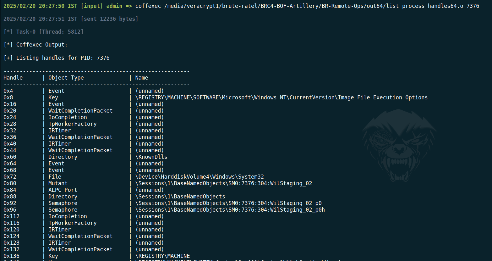