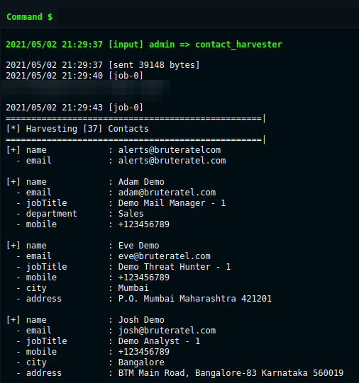
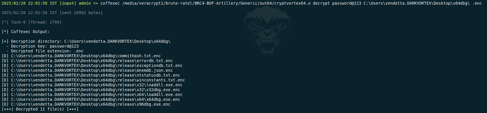
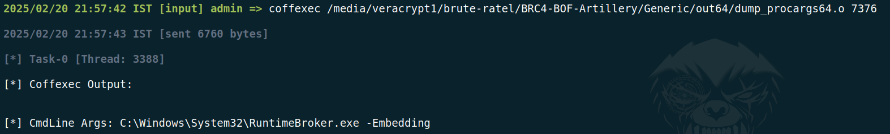
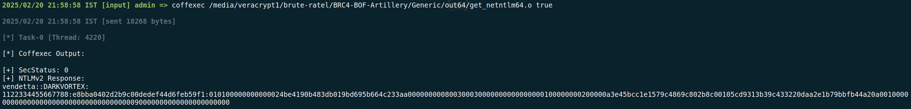
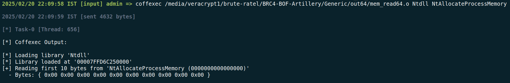
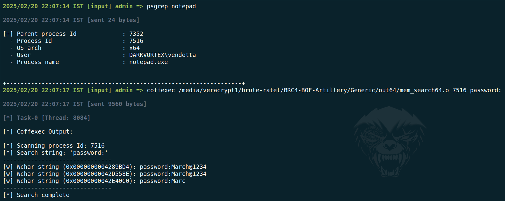
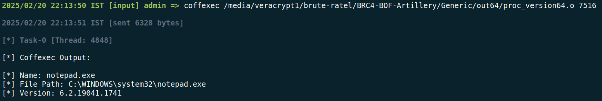
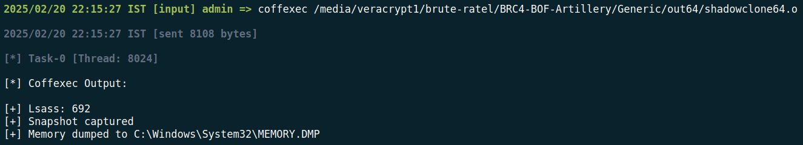

# Generic

This repository includes a collection of generic BOFs I wrote over a period of time. This repository solely focuses on porting and execution, without modifying the original source for stability. While I may conduct further testing in the future, this is not officially supported.

## Contact Harvester

## Crypt Vortex 

### Encrypt

### Decrypt

## Dump Process Arguments

## Get NetNtlmv2 Hash

## Read Process Memory

## Search Process Memory

## Dump Process Version

## Dump Process Memory Via Snapshot

