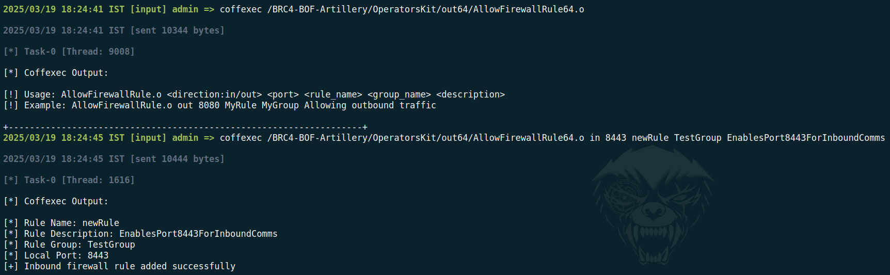
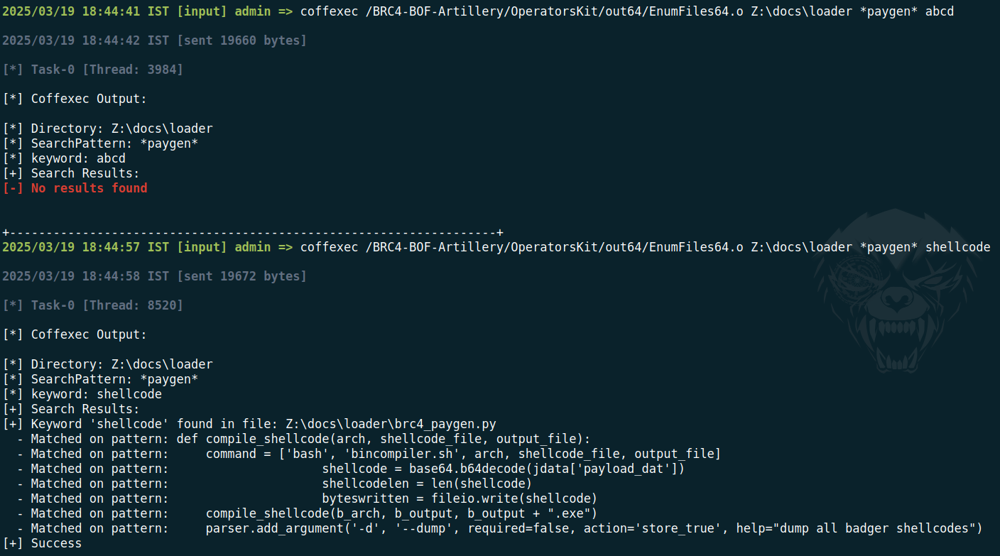

# Operators-Kit

This repository includes a port of Operators Kit from the below source. Any existing bugs in the original open-source projects have not been addressed and may not be fixed here. This repository solely focuses on porting and execution, without modifying the original source for stability. While I may conduct further testing in the future, this is not officially supported.

Source: https://github.com/REDMED-X/OperatorsKit

## Adds A Firewall Rule To Allow Inbound/Outbound Communication

## Enumerate files on current host

