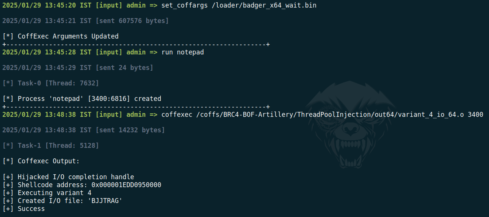
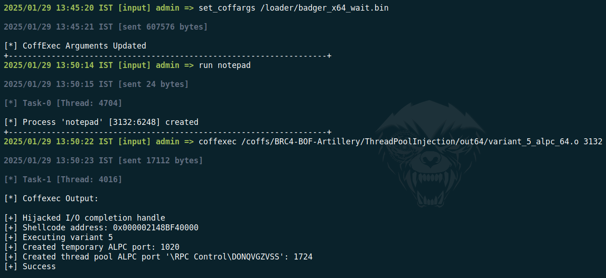
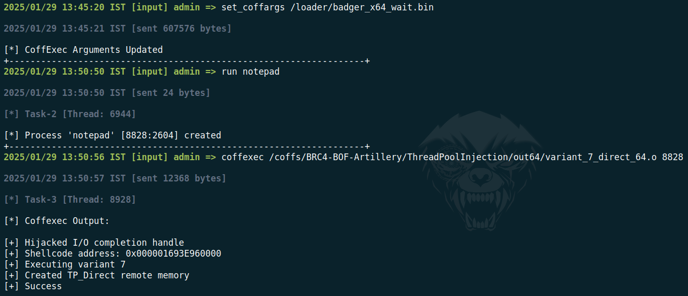
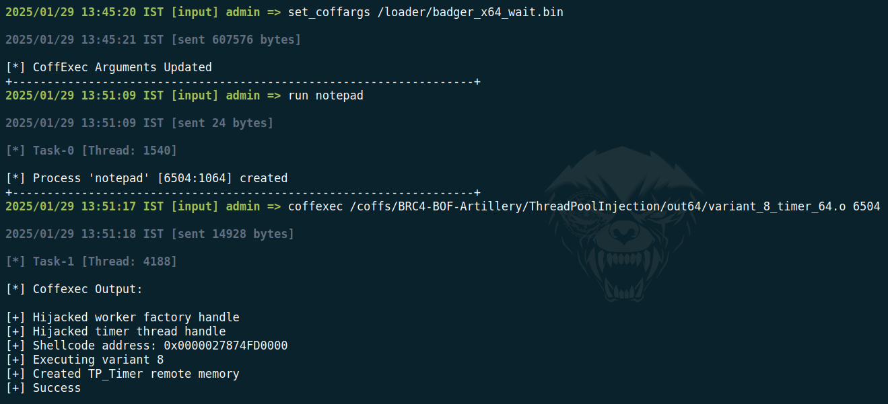

This repo was built to support BRc4 BOFs and the single file pool_injection_variants.c contains the variant injection types 4-8. 

Source 1: https://www.blackhat.com/eu-23/briefings/schedule/#the-pool-party-you-will-never-forget-new-process-injection-techniques-using-windows-thread-pools-35446

Source 2: https://github.com/SafeBreach-Labs/PoolParty/

## POC:

### Variant 4:

### Variant 5:

### Variant 6:

### Variant 7:

### Variant 8:

